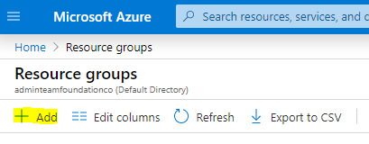
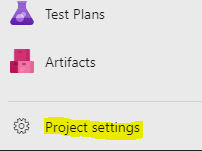

## Create Azure Resource Group

1. Log into your [Azure Subscription](https://portal.azure.com)
2. Create a new resource group that will contain all your Azure Resources for this sample by navigating to your Resource Groups and clicking on the __"Add"__ button
 
3. Give it a descriptive name, select an appropriate location and complete the creation

## Create a new Azure DevOps Organisation
Now log into your Azure DevOps organisation.

_If you do not have one, create a [free one now](https://azure.microsoft.com/en-us/services/devops/)_

### Create a new Team Project and import the sample application
If you created a new Azure DevOps instance, the flow will ask you to create a new project. If you have and existing organisation follow the following steps: 
1. Create a new "Team Project" by clicking the  button on the organisation landing page
2. Give the project a descriptive name ( like 'virtualdevopslab'), expand the 'Advanced' section and confirm that Git is selected as your repository type then click "Create"

When the project has been created, navigate to it.
1. It should automatically take you to the project's landing page.
2. Click on the __"Repos"__ vertical on the left (  ), which should take you to an empty repository. 
3. It will give you a couple of options, select __"Import"__.
4. It will present you with a flyout and ask the clone URL. Enter the following URL [https://github.com/NielZeeman/virtualdevops_labs.git](https://github.com/NielZeeman/virtualdevops_labs.git) and select __"Import"__

## Create a Service Principle in Azure DevOps
Now that you have a Azure DevOps environment and a Azure Resource Group, you need to link the two.
1. Navigate to your Azure DevOps Project portal
2. Select __"Project Settings"__ on the bottom - left of your verticals menu

3. Scroll to the bottom of the available options and select __"Service Connections"__
4. Create a new service connection, and select __"Azure Resource Manager"__ in the available options and click __"Next"__
5. Leave the authentication method as the default, and click __"Next"__
6. On the "New Azure service connection" page, set the following properties:

|Property|Value|
|---|---|
|Scope Level |Subscription|
|Subscription |_your subscription_|
|Resource Group |_The one you created above (You may need to login to see the list)_|
|Service connection name|_a name of your choosing_|
| Grant access permissions to all pipelines | _checked_|

### Overview
You have not created a new Azure DevOps Team Project and imported the sample application as well as created your own presource group  in Azure. 

Next we will create an automated [build definition](./2.BuildDefinition.md)
