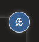
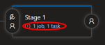

## Create a new automated release
In this section, we will configure a template for the creation of a container based Web App in Azure and then setup a Continuous Delivery (CD) pipeline to deploy the container when it is updated.

### Create a Web App template
In this section you will see how easy it is to create a template that is used in your deployment for the automated creation of resources in Azure

1. Open up your Resource Group in Azure Portal
2. Add a new Resource by clicking on the __"Add"__ button
3. Search for "Web App" and then when the Web App overview comes up, select __"Create"__
4. Make sure that the values are entered as follows:

|Variable |Value |
|---|---|
|Resource Group|_your working resource group_|
|Name|_enter a unique name for your web app_|
|Publish|"Docker Container"|
|Operating System|"Linux"|
|Region|"South Africa North"|
|Sku and size| Select __"Change size"__ and then select __"Dev/Test"__ | B1 and __"Apply"__|

5. Click __"Next"__

6. Under Docker options ensure the following:

|Variable |Value |
|---|---|
|Options| "Single Container"|
|Image Source|"Azure Container Registry"|
|Registry|_select the one created during the build_|
|Image|"devopsvirtuallabs"|
|Tag|_leave empty or select the latest for now_|

7. Click __"Review + create"__

8. In the bottom toolbar select __"Download a template for automation"__. It will bring up the definitions of the ARM template and give you various snippets for execution. Select __"Download"__ from the top toolbar
9. It should download a zip file to your local machine. Extract it and open the "template.json" file
10. Copy the contents of the file
11. Go to your Azure DevOps Repos through your web browser and select __"Files"__ in the repository that was cloned earlier. Navigate to the __"src"__ folder
12. Select the "Templates" folder and click on the vertical dots to open the command menu. Select __"New->File"__:

13. Name the new file "web_app_template.json", and paste the contents of the template.json file in it. Commit your change
14. Do the same for the "parameters.json" file that is located with the template.json file in the zip file, but name it "web_app_parameters.json" when creating the file in the Git repo

### Create Release Pipeline
1. In Azure DevOps open the __"Pipelines->Releases"__ vertical
2. Create a new pipeline by clicking on the __"New pipeline"__ button
3. Under the __"Select a template"__ heading click on __"Empty Job"__. Close the "Stage 1" flyout
4. In the __"Artifacts"__ area click the __"Add"__ button
5. On the flyout select __"Build"__ then the Project that you are working in, then the "Source (build pipeline)" that you created in the previous section. Leave the rest as default and click __"Add"__.
6. Click on the __"Continous Deployement Trigger"__  and enable the __"Continuous deployment trigger"__
7. Next select the "Stage 1" tasks ( ) 
8. On the "Agent job" click the __"+"__ to add a new task. Search for "Azure Resource Group Deployment", hover over it and click __"Add"__
9. Then search for "Azure App Service Deploy", hover over it and click __"Add"__
10. Select the "Azure Resource Group Deployment" task under the "Agent Jobs" and configure as follows:

|Parameter|Value|
|----|----|
|Azure Subscription |_select the one that was added previously_|
|Action |"Create or update resource group"|
|Resource Group |_select the appropriate Resource Group_|
|Location| "South Africa North"|
|Template |_click the "..." next to the field, and select the "web_app_template.json" in the "templates" folder_|
|Template parameters |_click the "..." next to the field, and select the "web_app_parameters.json" in the "templates" folder_|
|Override template parameters|add "-dockerRegistryPassword $(RegistryPassword)"|

11. Next, select the "Azure App Service Deploy" task, and configure as follows:

 |Parameter|Value|
|----|----|
|Azure Subscription |_select the one that was added previously_|
|App Service type |"Web App for Containers (Linux)"|
|App Service Name |_type in the app service name selected when you created the "Web App" template_|
|Registry or Namespace |_the name of your Container Registry with ".azurecr.io" after it (example devopsvirtuallabsacr.azurecr.io)_"|
|Image|"devopsvirtuallabs"|
|Tag|"$(Build.BuildId)"|

12. Navigate to __"Azure Portal -> Your Resource Group -> Your Container Registry"__. On your Registry, under __"Settings"__ open the __"Access keys"__ blade and copy the value in the __"password"__ field
13. Back in your Release Pipeline, select the __"Variables"__ tab, select __"Pipeline variables"__ and click __"Add"__.  Add a new variable with the name "RegistryPassword" and the value you just copied from the Container Registry password field. Then select the "lock" next to the variable value to make it hidden
12. Click in the top where it says __"New release pipeline"__ and give the release a name of your choice, then click __"Save"__ , leaving it in the default folder
13. Click __"Create Release"__, and __"Create"__ at the bottom of the fly-out
14. Follow the release on the summary page until it has deployed completely
15. Navigate to your Resource Group in the Azure Portal and refresh it by clicking on the __"Refresh"__ button just above the resource list
16. You should see the new Web App created. Click on it and open the "Overview" blade. On the top right hand you should see the Web App "Url". Click it to open the newly created Web App

### Overview
You have created an ARM template to automate the creation of a Web App. You then created a Release Pipeline to deploy the publish the template and deploy the docker image to the Container based Web App

